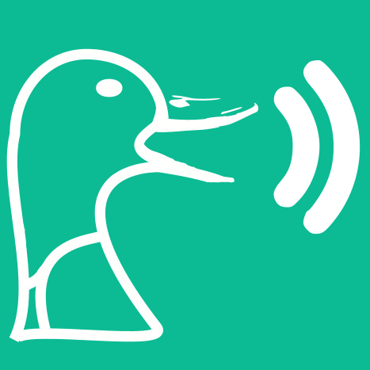

<div align="center">
  <p>
    <h1>
      <a href="#readme">
        
      </a>
      <br />
      Soundux
    </h1>
    <h4>A cross-platform soundboard in QtQuick</h4>
  </p>
  <p>
    <a href="https://github.com/D3SOX/Soundux/releases">
      
    </a>
    <a href="https://github.com/D3SOX/Soundux/blob/master/LICENSE">
      
    </a>
    <a href="https://discord.gg/4HwSGN4Ec2">
      
    </a>
  </p>
</div>

## Index
- [Introduction](#introduction)
- [Runtime Dependencies](#runtime-dependencies)
- [Compilation & Installation](#compilation--installation)
  - [Arch Linux and derivatives](#arch-linux-and-derivatives)
  - [Windows](#windows)
    - [Dependencies](#dependencies)
  - [Other distros](#other-distros)
    - [Dependencies](#dependencies-1)
    - [Install dependencies for Ubuntu and derivatives](#install-dependencies-for-ubuntu-and-derivatives)
    - [Build](#build)
    - [Install](#install)
- [Why _Soundux_?](#why-soundux)
- [License](#license)
- [TODO](#todo)

# Introduction
Soundux is a cross-platform soundboard that features a simple user interface.
With Soundux you can play audio to a specific application on linux and to your vb-audio-cable sink on windows.

# Runtime Dependencies
Please refer to your distro instructions on how to install
- [pulseaudio](https://gitlab.freedesktop.org/pulseaudio/pulseaudio)

# Compilation & Installation

## Arch Linux and derivatives
You can install my package with your AUR helper of choice which will automatically compile and install the master branch
```sh
yay -S soundux-git
```

## Windows
*(We highly recommend you to just download the latest release for windows since it has all its dependencies packed with it)*

To compile on windows you'll have to install qt (*make sure the the important qt-paths are in your system-path!*)
### Dependencies
- [VB-Audio Cable](https://vb-audio.com/Cable/)
- [Qt](https://www.qt.io/download-thank-you?os=windows)
- MSVC
- CMake

After installing the dependencies you should be able to follow the normal build steps!

## Other distros

### Dependencies
This list may be not accurate. Contact me if you find missing dependencies that I can update this list
- [qt5-base](https://github.com/qt/qtbase)
- [qt5-tools](https://github.com/qt/qt5)

### Install dependencies for Ubuntu and derivatives
```sh
sudo apt install git qt5-default libqt5x11extras5-dev
```

### Build
Clone the repository
```sh
git clone https://github.com/D3SOX/Soundux.git
cd Soundux
git submodule update --init --recursive
```
Create a build folder and start compilation
```sh
mkdir build
cd build
cmake ..
make
```
To start the program
```sh
./soundux
```

### Install
Automated Installation is currently not available but will be available in the future. (You may look into my [arch package](https://aur.archlinux.org/cgit/aur.git/tree/PKGBUILD?h=soundux-git) and figure it out for your distro)

# Why _Soundux_?

**Sound**board for Lin**ux**

# License
The code is licensed under [GPLv3](LICENSE)

# TODO
- [ ] Playlist mode (play sounds one after another)
- [ ] Icons in Output application dropdown on linux
- [ ] Improve the logo
- [ ] Volume normalization
- [x] Play sounds while another sound is playing
- [x] Organize code
- [ ] Grid View
- [ ] Save window size
- [ ] Save volume states (+ Sync state)
- [ ] Add ability to move tabs
- [ ] Localization
- [ ] Package it as deb and flatpak and create a repology
- [ ] Support macOS
- [ ] Fix FileDialog on windows (it's currently bugged and you have to just manually insert the path of the folder you want to add in the navigation bar)
