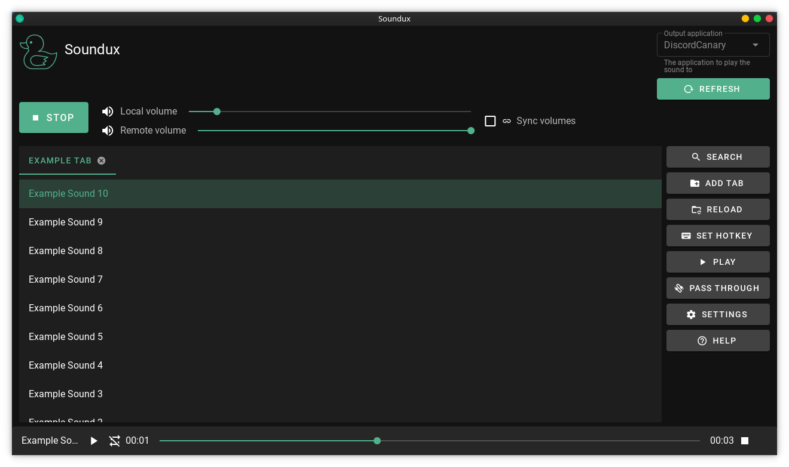
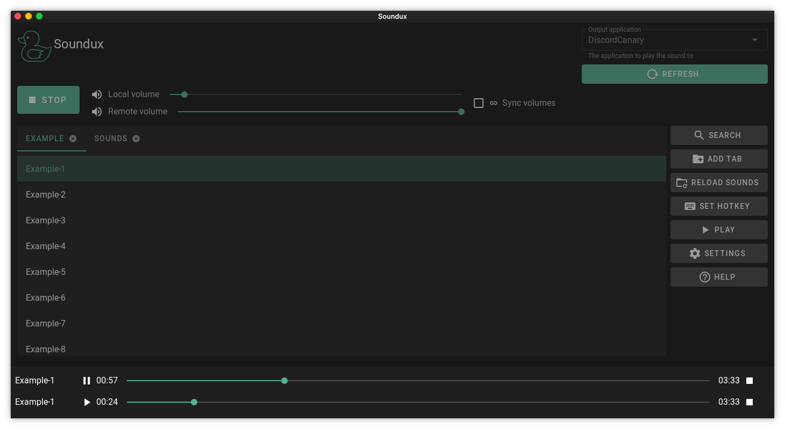
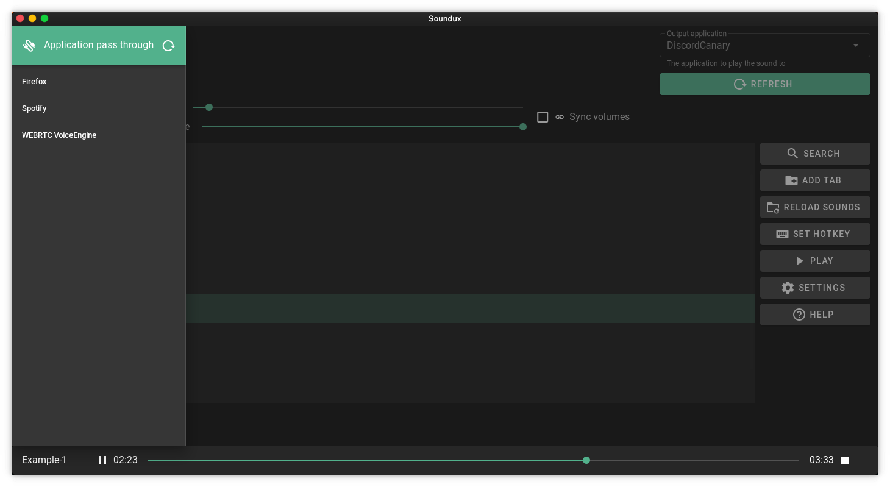
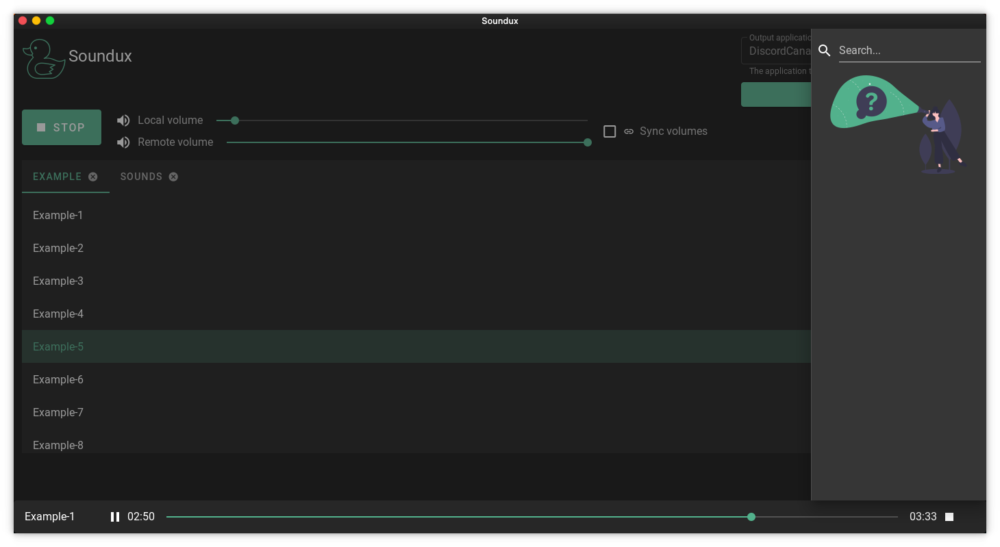
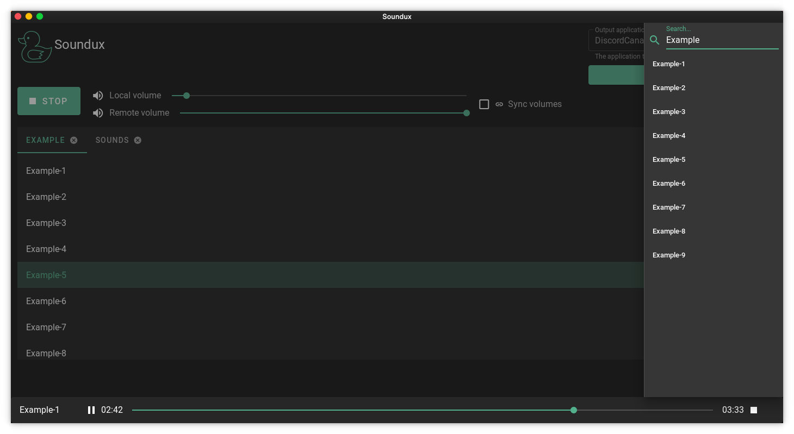
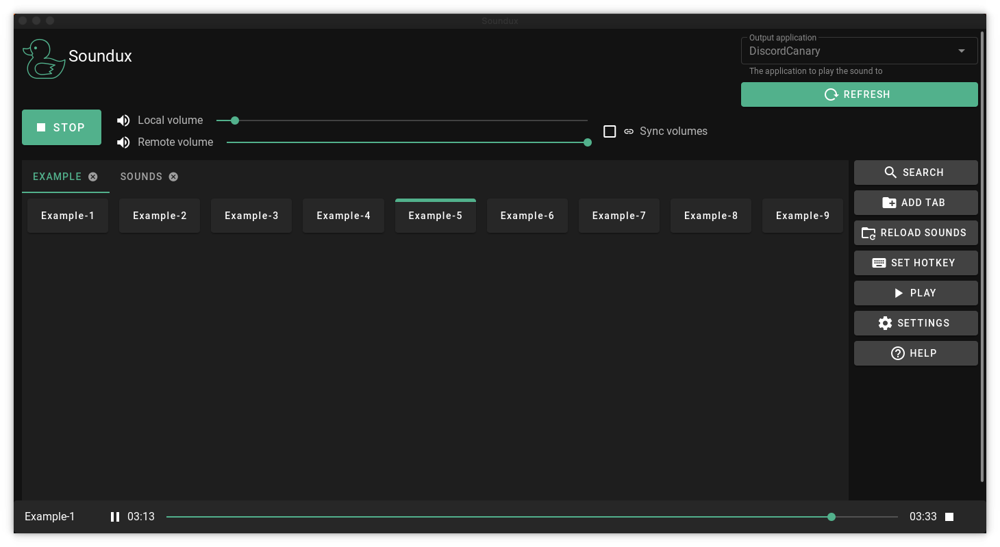
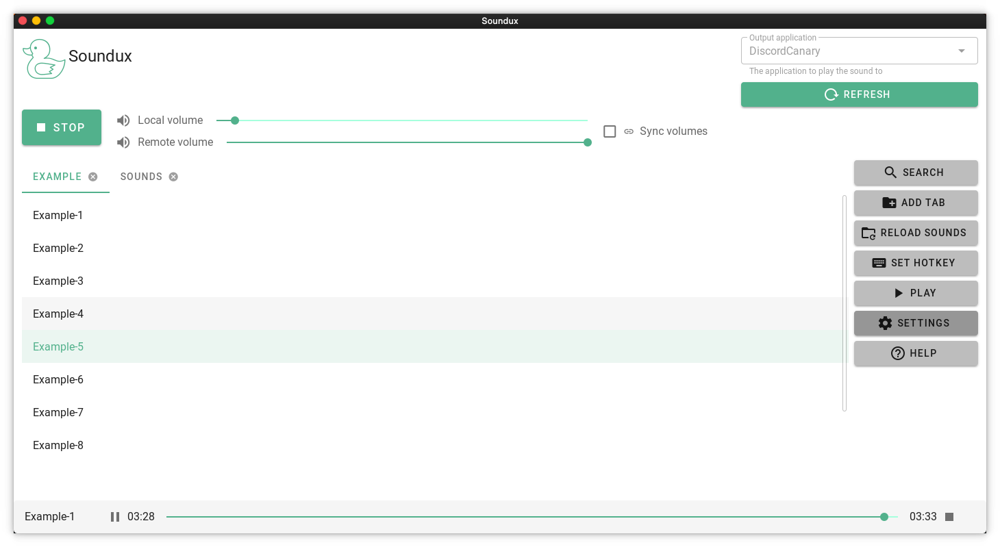
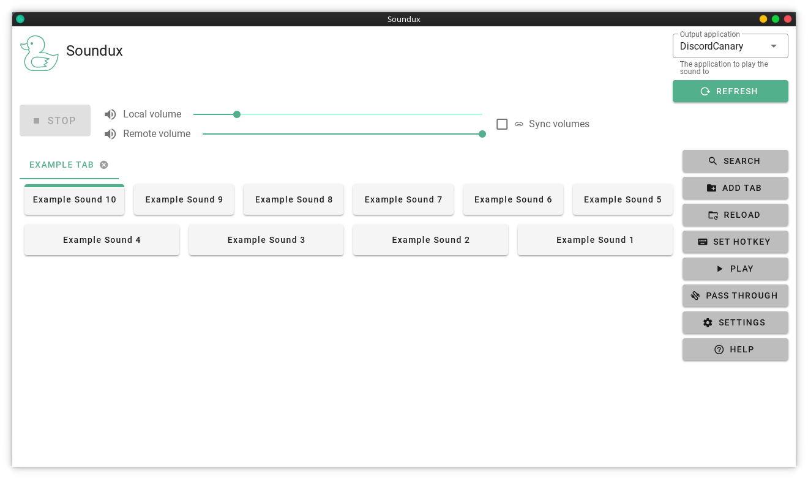

<div align="center">
  <p>
    
    <br>
    <h6>A cross-platform soundboard 🔊</h6>
    <br>
    
    
    
    <br>
    <a href="https://github.com/Soundux/Soundux/releases">
      
    </a>
    <a href="https://discord.gg/4HwSGN4Ec2">
      
    </a>
    <a href="https://github.com/Soundux/Soundux/blob/master/LICENSE">
      
    </a>
    <br>
    <a href="https://github.com/Soundux/Soundux/actions?query=workflow%3A%22Build+on+Windows%22">
      
    </a>
    <a href="https://github.com/Soundux/Soundux/actions?query=workflow%3A%22Build+on+Linux%22">
      
    </a>
    <a href="https://github.com/Soundux/Soundux/actions?query=workflow%3A%22Build+Flatpak%22">
      
    </a>
  </p>
</div>

# Preview
|   |       |
| -------------------------------------------- | ------------------------------------------------------ |
|         |                  |
|      |    |
|  |  |

# Introduction
Soundux is a cross-platform soundboard that features a simple user interface.
With Soundux you can play audio to a specific application on Linux and to your VB-CABLE sink on Windows.

# Runtime Dependencies
These are required to run the program

## Linux
Please refer to your distro instructions on how to install
- [pulseaudio](https://gitlab.freedesktop.org/pulseaudio/pulseaudio)
- Xorg
- Webkit2gtk
## Windows
- [VB-CABLE](https://vb-audio.com/Cable/) (Our installer automatically installs VB-CABLE)
- [Webview2 Runtime](https://developer.microsoft.com/de-de/microsoft-edge/webview2/) (Is also shipped with the installer)

# Installation

## Linux

### Arch Linux and derivatives
You can install our package with your AUR helper of choice which will automatically compile and install the latest release version
```sh
yay -S soundux
```
We also provide a `soundux-git` package which compiles from the master branch

### Other distros
You can grab the latest release from Flathub

<a
 href='https://flathub.org/apps/details/io.github.Soundux'></a>

## Windows
Download our installer or portable from [the latest release](https://github.com/Soundux/Soundux/releases/latest)

# Compilation

## Build Dependencies

### Linux
This list may not be accurate. Contact me if you find missing dependencies so that I can update this list
- Webkit2gtk
- X11 client-side development headers

#### Debian/Ubuntu and derivatives
```sh
sudo apt install git build-essential cmake libx11-dev libxi-dev libwebkit2gtk-4.0-dev
```

### Windows
- Nuget
- MSVC
- CMake

## Build
Clone the repository
```sh
git clone https://github.com/Soundux/Soundux.git
cd Soundux
git submodule update --init --recursive
```
Create a build folder and start compilation
```sh
mkdir build
cd build
cmake ..
cmake --build . --config Release
```
To start the program
```sh
./soundux # .\soundux.exe on Windows
```

## Install

### Linux
```sh
sudo make install
```
Automated Installation is currently not finished and will only install the binary. It will be fully functional in the future. (You may look into my [arch package](https://aur.archlinux.org/cgit/aur.git/tree/PKGBUILD?h=soundux-git) and figure it out for your distro)

# Why _Soundux_?

The project started as a **Sound**board for Lin**ux**

# License
The code is licensed under [GPLv3](LICENSE)
